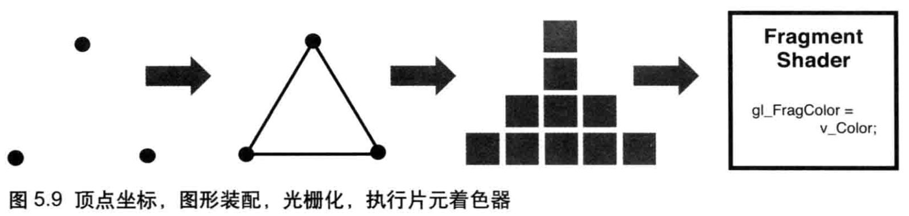
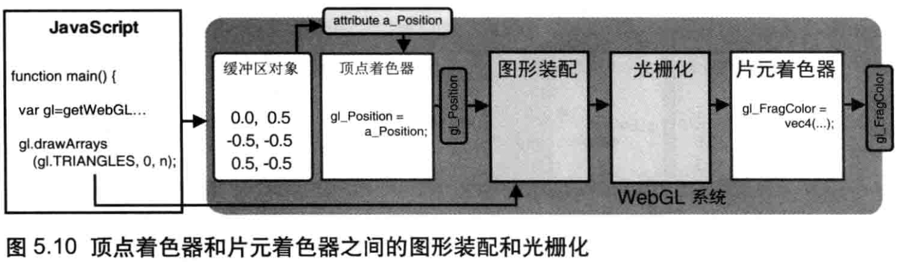

# 颜色纹理

## 非坐标数据传入顶点着色器

除了顶点坐标，我们还可以给着色器传入顶点大小，顶点颜色等数据，依然是使用上一章的创建**缓存区**来实现。

[传入顶点大小demo](http://127.0.0.1:3000/chapter5/lesson1)

[顶点坐标和大小合并缓存区demo](http://127.0.0.1:3000/chapter5/lesson2)

[传入顶点颜色demo](http://127.0.0.1:3000/chapter5/lesson3)

## 着色器之前的数据传输

在顶点着色器和片元着色器之间有两个过程: **图形装配**和**光栅化**

**图形装配**将鼓励的顶点坐标装配成几何图形，也称**图元装配**，**光栅化**将装配好的几何图形转换为片元

两着色器之间装配和光栅化过程如下图