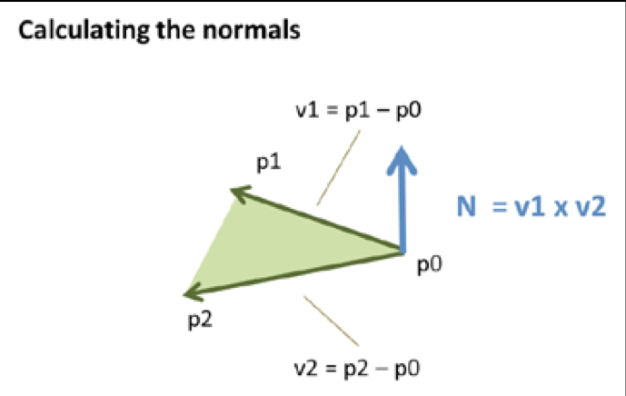
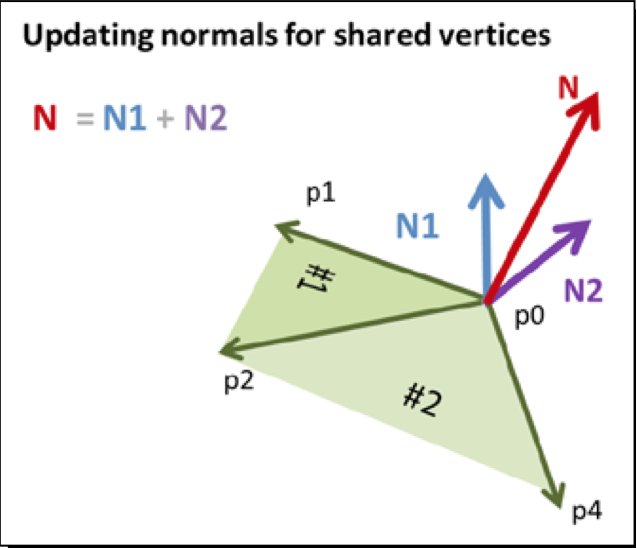
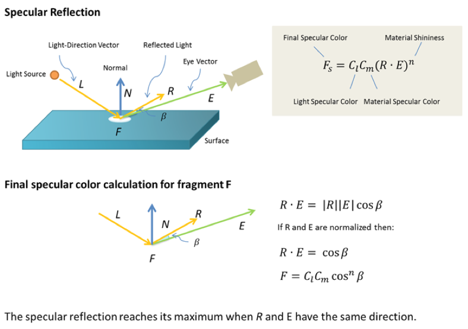
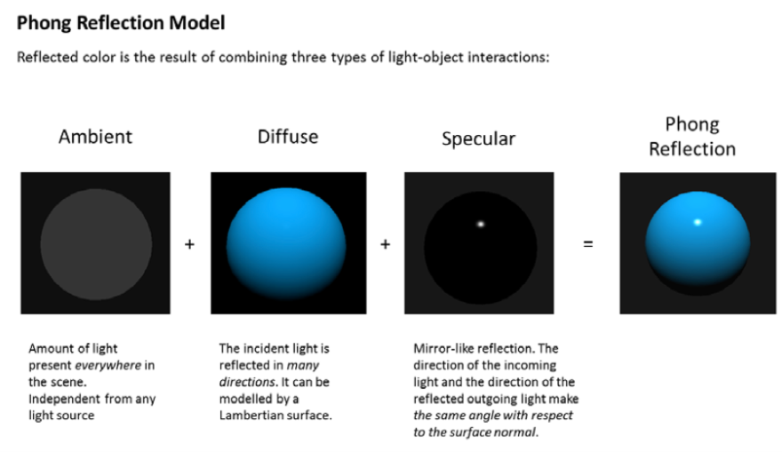
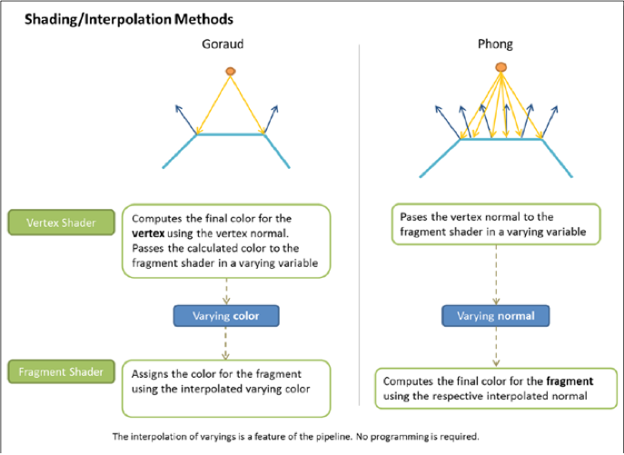

# 光照

在现实生活中，我们能看到某个物体是因为它能反射光。一个物体反射光的程度取决于它的位置和离光源的距离，以及表面材质。

光照使场景更具有层次感，更贴近现实。

## 光照原理

现实世界中，当光线照射到物体上时，会发生两个现象:

* 根据光源和光线方向，无题不同表面的明暗成都变得不一致（着色）

* 根据光源和光线方向，物体向地面投下影子（阴影)

## Lights(光源)

### directional(平行光)

无限远处的光源发出的光，光线是相互平行的，不受距离影响，具有方向。可以用一个方向和一个颜色来定义。

### positional(点光源光)

从一个点向周围所有方向发出的光，远的物体只能接收到微小的光线，光源的位置会影响场景的亮度。光线的方向将根据点光源的位置和被照射之处的位置计算。

### enviroment(环境光)

经光源发出后被其他物体多次反射再照到物体表面的光，环境光强度与角度无关。用一个颜色来定义。

### use in shader

光线和材质作为uniforms传递，uniforms在vertex shader和fragment shader中都可以使用。这给了我们很多弹性，我们可以在vertex shader中决定光如何反射或者在fragment shader中决定。

## light reflection(反射类型)

物体向哪个方向反射光和反射光颜色取决于两个因素: **入射光**和**物体表面类型**。

入射光包括入射光方向和颜色

物体颜色包括表面固有色和反射特性

反射光公式: `<反射光颜色> = <漫反射光颜色> + <环境反射光颜色> + <镜面反射>`

### ambient reflection(环境反射)

针对环境光

反射光方向是入射光反方向

反射光各方向均匀，强度相等

环境反射公式: `<环境反射光颜色> = <入射光颜色(环境光颜色)> * <表面基底色>`

[demo](http://127.0.0.1:3000/chapter8/lesson1)

### diffuse reflection(漫反射)

针对平行光和点光源

反射光的颜色取决于入射光的颜色，表面的基底色，入射光与表面形成的入射角(入射光与表面的法线夹角Ɵ)。

漫反射各方向均匀

漫反射光公式: `<漫反射光颜色> = <入射光颜色> * <表面基底色> * cosƟ`

入射角公式: `<cosƟ> = <光线方向> * <法线方向>`

光线方向是入射光反方向，光线和法线长度必须为1，使用GLSL ES提供的内置函数进行**归一化(normailize函数)**处理

入射光方向根据光源不同算法不同

平行光光线方向固定，直接**归一化**后计算即可

[demo](http://127.0.0.1:3000/chapter8/lesson1)

点光源光线方向为发散型，先计算顶点变换后世界坐标`<顶点世界坐标> = <模型矩阵> * <顶点坐标>`，再将点光源位置与其相减后`<光线方向> = <电光源位置> - <顶点世界坐标>`，再进行**归一化**得到光线方向。

[demo](http://127.0.0.1:3000/chapter8/lesson3)

#### Normals(法线)

物体表面的朝向，即垂直于表面的方向。

一个表面具有2个法向量，分别是表面正面和背面的法向量，顶点顺时针是正面，逆时针是反面。

法线是每个vertex的基础信息，它会被存储在VBO中与WebGL的属性相关联。每个vertex都有一个对应的法线向量，法向量只表示方向，需要规范化（normalized）。

### specular reflection(镜面反射)

镜面反射顾名思义。它是视线和反射的光线向量的点积，当这个点积为1时，摄像头捕捉到的光线最强。这个点积之后经过n次方运算，n代表表面的光亮度。最后再与光线和材质的specular color相乘。

### Phong reflection model(补色反射模型)

Phong reflection描述了一种表面反射的方式，它是以上三种反射:相邻反射（ambient），漫反射（diffuse）和镜面反射（specular）的相加。

## 法向量变换

假如立方体进行旋转，每个表面颜色会根据旋转角度而发生变化，因为每个表面的法向量在不断变化。

平移不会改变法向量

旋转会改变法向量

缩放一般情况下xyz轴上缩放值相同，则不会改变法向量，反之，则会改变。

### 逆转置矩阵

`<变换后法向量> = <模型矩阵的逆转置矩阵> * <法向量>`

逆转置矩阵计算，求原矩阵M的逆矩阵R(M\*R|R\*M为单位矩阵)，再将逆矩阵进行转置(行列互换)

| 方法 | 描述 |
|---|---|
| Matrix4.setInverseOf(M)|使自身成为矩阵M的逆矩阵|
| Matrix4.tranpose()|对自身进行转置操作，并将自身设为专职后的结果|

[demo1](http://127.0.0.1:3000/chapter8/lesson2)
[demo2](http://127.0.0.1:3000/chapter8/lesson3)

## Reflection Model(光照反射模型)

阴影（shading）和光照（lighting）这两个术语很容易被混淆。但是它们却代表着两个不同的概念阴影一般表示我们获得每个fragment的最终颜色所采用的描影（interpolation）方式；一旦阴影模型建立了，光照模型决定了如何利用法线、材质和光线来生成最终颜色。光照模型的公式使用了物理的光照反射。

### Goraud shading(高洛德着色或高氏渲染)

Gouraud明暗处理只在多边形顶点处采用Phong局部反射模型计算光强，而在多边形内的其他点采用双向线性插值，这样做的优点是高效，但是无法很好的处理镜面高光问题，依赖于其所在多面形的相对位置；

它可对3D模型各顶点的颜色进行平滑、融合处理，将每个多边形上的每个点赋以一组色调值，同时将多边形着上较为顺滑的渐变色，使其外观具有更强烈的实时感和立体动感，不过其着色速度比平面着色慢得多但是效果要好得多。

Goraud interpolation是在vertex shader中进行计算的。vertex法线会被用于计算中。最后的颜色会通过varying参数传递到fragment shader中。由于渲染管线会提供varying自动描影的功能，最后每个fragment都会具有经过描影的颜色。

### phong shading(补色渲染)

目前最好、最复杂的着色方法，效果也要优于GouraudShading。补色渲染主要弥补了光照对物体颜色的影响。

Phong明暗处理，通过差值计算每个顶点的法向量（3次差值，在x，y，z三个方向分别进行差值计算），然后计算每个点上的光强值，这样效果好，但计算复杂，需要付出比Gouraud 4-5 倍的时间。

Phong interpolation在fragment shader中进行计算。为此，vertex法线会被作为varying传递到fragment shader中。由于描影机制的作用，每个fragment都会有自己的法线。它会被用于生成最后的颜色，具体如下图所示。

> 通常，在一个比较复杂的场景中，当物体镜面发射很微弱时，我们对其采用Gouraud明暗处理，而对于一些镜面高光的物体，采用Phong明暗处理，这样既保证质量，又保证速度。

[demo](http://127.0.0.1:3000/chapter8/lesson4)